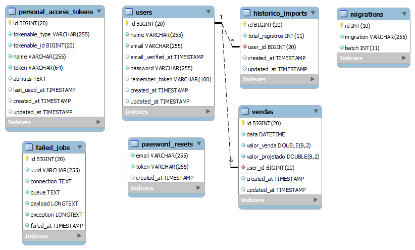

# Acompanhamento de vendas com Laravel v8
Projeto feito com Laravel 8 para importar e exportar planilha excel com dados de vendas realizadas e exibir em gráficos.

Visualizar demo: https://ac-vendas.herokuapp.com/

## Frameworks
- [x] Laravel 8
- [x] Bootstrap 5

## Sevidor
- PHP 7.2^
- MySQL v5.7^ 

## Template
[Material Dashboard 2](https://www.creative-tim.com/product/material-dashboard)

## Páginas
### Página 1 - Login (Página pública)
Página com formulário para fazer login e link para criar conta

### Página 2 - Criar conta (Pública)
Formulário para registro de usuário com os campos:
- Nome Completo (Obrigatório, min 3 caracteres)
- E-mail (Obrigatório, email, único)
- Senha (Obrigatório, min 8 caracteres, ter letras e números)
- Repetir Senha

### Página 3 - Página Inicial (Página Privada)
Contém gráficos e resumo dos dados da última planilha importada.

<!-- ### Página 3 - Planilhas (Privada)
A página contém uma tabela com todas as planilhas que foram feitas upload, com opções para visualizar, importar, baixar e remover. -->

### Página 4 - Importar Planilha (Privada)
Formulário para fazer upload da planilha. Ao fazer upload vai extrair os dados e armazenar no banco de dados.

Formatos suportados: xlsx, csv, ods, xls, html e xml

**Exemplo de planilha**
<table>
<tr>
<th>Data</th>
<th>Real</th>
<th>Projetado</th>
</tr>
<tr><td>01/12/2021</td><td>400</td><td>300</td> </tr>
<tr><td>01/12/2021</td><td>350</td><td>300</td> </tr>
<tr><td>01/12/2021</td><td>560</td><td>300</td> </tr>
</table>

### Página 5 - Exportar Planilha (Privada)
Página para exportar os dados de vendas nos formatos de arquivo: xlsx, csv, ods, xls, html e pdf.

### Página 6 - Vendas (Privada)
Contém uma tabela com paginação para exibir todos os dados, essa página é utilizada com iframe em algumas páginas.

## Comandos utilizados
```
composer require laravel/ui
php artisan ui:auth
php artisan ui bootstrap
npm install && npm run dev
// https://github.com/lucascudo/laravel-pt-BR-localization 
composer require lucascudo/laravel-pt-br-localization --dev
// https://docs.laravel-excel.com/3.1/getting-started/installation.html
composer require maatwebsite/excel
composer require dompdf/dompdf
// https://github.com/felipedamacenoteodoro/makeservicerepository
composer require felipedamacenoteodoro/makeservicerepository --dev
```

## Modelo do banco de dados


## Instalação
**Instale as dependências**
```
composer install --no-scripts
```
**Copie o arquivo .env.example**
```
cp .env.example .env
```
**Crie uma nova chave para a aplicação** 
```
php artisan key:generate
```
**Configure o banco de dados (utilizei o MySQL) no arquivo .env e rodar os migrations com:**
```
php artisan migrate
```
**Executar os seeders**
```
php artisan db:seed
```
**Iniciando a aplicação**
```
php artisan serve
```
**Login**

E-mail: adm@teste.com<br>
Senha: 12345678
